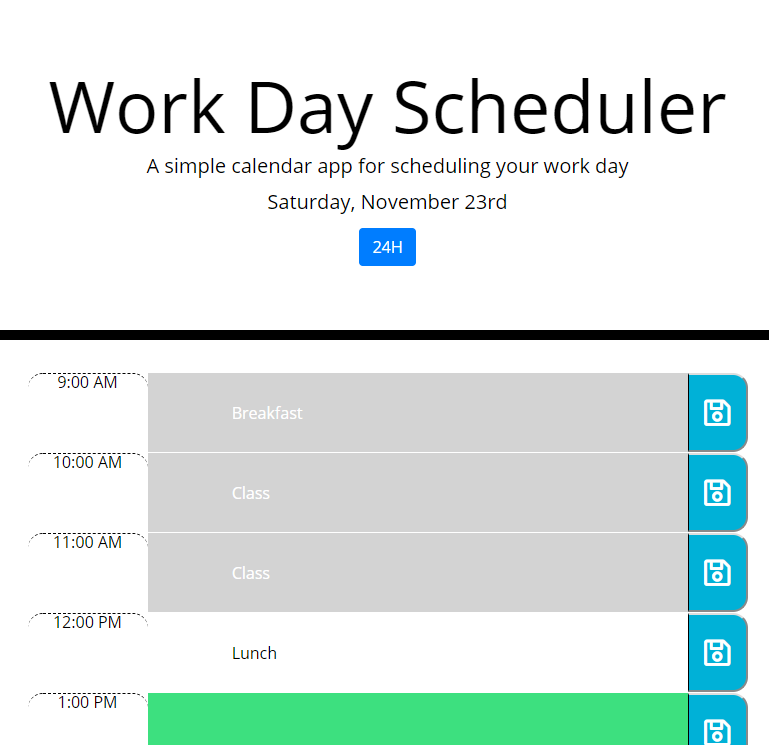

# The Coding Quiz

## Description 
This repository is used to create a day planner. The calendar renders based on data in local storage. If there is no data in local storage, the calendar renders with all the input sections blank. The inputs can be filled in and saved at any time. The input is color coded based on current time. The blue button at the top allows the user to switch the time format.

## Live site: 
https://sirpotatoiv.github.io/day-planner/

## Images
Starting View:

Starting View with info:

Full calendar View:

## Installation 
If all files are kept in a single folder a web browser should be able to run the project and you have an internet connection.

## Usage 
The usage of this is just for me to practice HTML, CSS, and javascript. It could be used to create a quiz.

## Credits 
I created this code based on the homework prompt created by Triology Education Services. Certain pieces of code I used online resources for help. In addition, several portions of code were created based on in class activities. I have included citations in the form of comments throughout the html and javascript.

## Contributing 
I was the only one to work on this project, but of course I had help from my instructor, TA's, and classmates.

## Challenges
The big listen learned was always complete all the work necessary to meet the requirements of the homework before adding additional features that are not needed. I ended up trying to add a feature before this README was created very close to the deadline for this assignment. I also broke my code, change so areas of code that were not part of the new feature, and ran out of time to meet the requirements for a perfectly good project. Scope creep is real.

From a coding perspective I struggled with figuring out how to setup an event listener of a dynamically created button to get the value from a specific dynamically created input. The trick was using event, which I luckily accidently learned through an activity the night before. The concept of the variable from an event listener called event is still very new to me. I also ran into an issue with my code in the event listener running into an error and breaking the code at what seemed to be purely random. The root cause of the issue was that I had an icon element as a child to a button element. I did not realize that an icon element could be clicked and it would trigger the buttons event listener. This caused the variable "event" to have object properties related to the icon and not the button. The object and properties did not line up the same way as the button causing the code to break. I negated this by adding the icon classes to the button causing the icon image to show up in the button and removed the icon element. 

## License
[MIT](https://choosealicense.com/licenses/mit/)